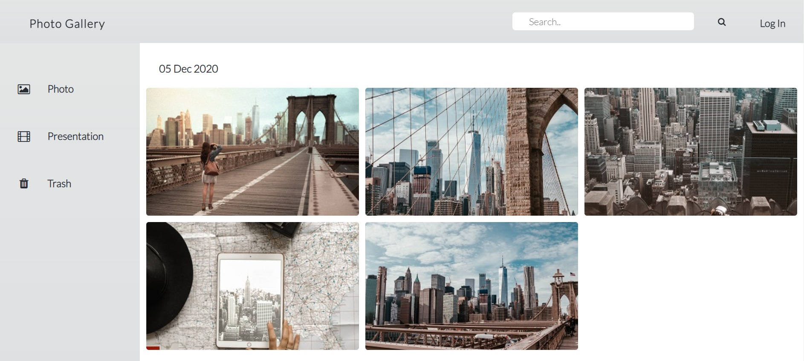

# Photo gallery
> Awesome gallery to store and visualize your photos. Contains the main view of all your photos with corresponding dates of photo publication and search functionality to display your photos by categories.

## Table of contents
* [General info](#general-info)
* [Screenshots](#screenshots)
* [Technologies](#technologies)
* [Setup](#setup)
* [Features](#features)
* [Status](#status)
* [Inspiration](#inspiration)
* [Contact](#contact)

## General info
This project is meant to improve my general knowledge of HTML, CSS and JavaScript.

## Screenshots

## Technologies
* HTML
* CSS
* JavaScript

## Setup
Clone Guit Hub repository and run the project in your Local Server.

## Features
List of features ready and TODOs for future development
* General photo gallery view
* Search by photo categories
* User identification (applied using localStorage)
* Mobile-first

To-do list:
* Individual photo view
* Photo presentation
* User collages

## Status
Project is: _in progress_

## Inspiration
This project is inspired by Google Photos

## Contact
Created by [@Anntroy](https://github.com/Anntroy) - feel free to contact me!
